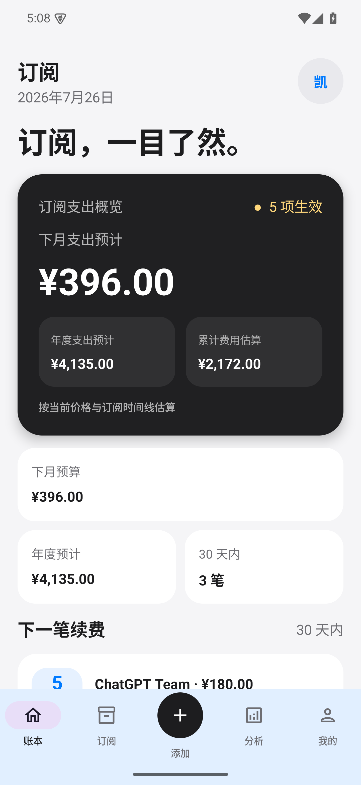
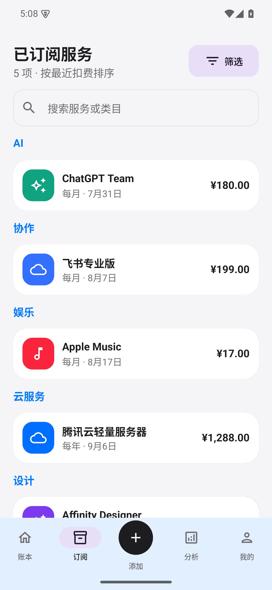
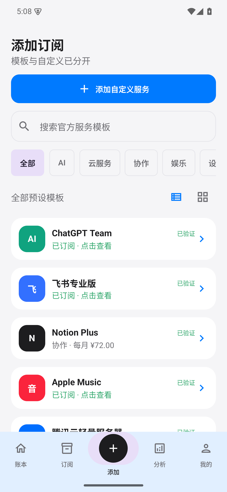
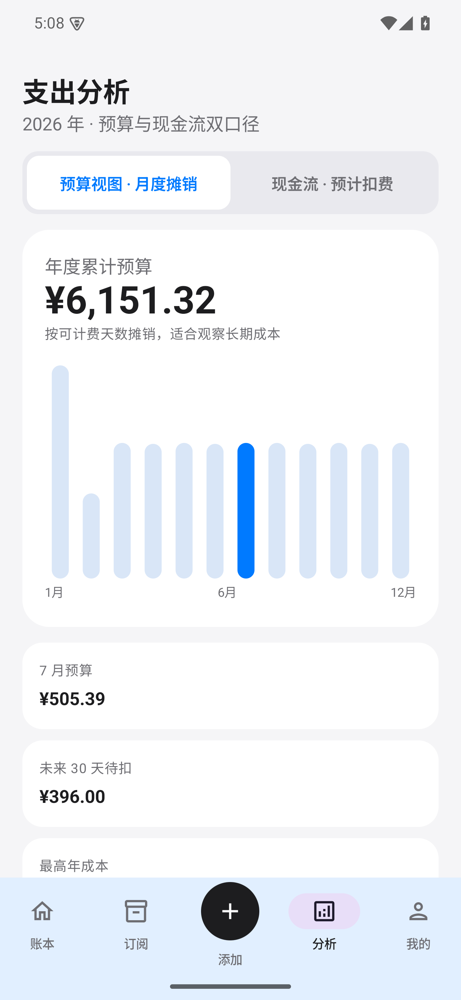

<p align="center">
  
</p>

<h1 align="center">订阅 · Android 原生客户端</h1>

<p align="center">
  把续费、支出估算、提醒和云端同步放在一起。
</p>

<p align="center">
  <a href="https://github.com/MengPng/subscription-manager-android/actions/workflows/android.yml"></a>
  <a href="https://github.com/MengPng/subscription-manager-android/releases/latest"></a>
  
</p>

<p align="center">
  <a href="https://github.com/MengPng/subscription-manager-android/releases/latest"><strong>下载最新稳定版 APK</strong></a>
  ·
  <a href="https://github.com/MengPng/subscription-manager-android/releases">查看全部版本</a>
  ·
  <a href="https://subscription.netkaize.com/">访问在线版</a>
</p>

> 支持 Android 8.0（API 26）及以上。新账户默认为空账本，不会自动写入演示数据。

## 应用预览

<p align="center">
  <a href="docs/screenshots/01-home.png"></a>
  <a href="docs/screenshots/02-subscriptions.png"></a>
</p>
<p align="center">
  <a href="docs/screenshots/03-add.png"></a>
  <a href="docs/screenshots/04-analysis.png"></a>
</p>

## 主要功能

- 管理每月、每年与一次性订阅，记录首次订阅日期、续费日、备注、类目、图标和官网。
- 支持生效、暂停、已取消和到期取消；暂停区间不计费。
- 展示月度支出预计、年度支出预计、累计费用估算、未来 30 天待扣和分类分析。
- 提供快捷服务模板与自定义添加；有权限的管理员可统一维护全局模板。
- 将下一笔续费变成可操作提醒，可确认续费或设置到期取消。
- 提供基于周期、年化成本和复盘状态的省钱提示。
- 支持本机修改后自动同步、每 24 小时、每 72 小时或不自动同步。

## 计算与同步可信度

- 费用估算按首次订阅日期、自然月/自然年周期、暂停区间和取消时间线计算；一次性服务只计入一次。
- 累计费用不是银行流水：它按当前价格回算历史周期。价格发生变化时，结果会随当前规则重新估算。
- 本机数据先即时落盘，云端同步使用修订号与变更标识，避免静默覆盖较新数据。
- 检测到本机与云端同时变更时，两个版本都会先备份，再由用户选择保留哪一份。
- 个人中心显示待同步状态与最近同步时间，并支持手动立即同步。
- 数据按账户隔离存储；登录新账户不会读取其他账户的订阅。

## 安装与更新

1. 进入 [GitHub Releases](https://github.com/MengPng/subscription-manager-android/releases)，下载最新 `dingyue-v*.apk` 和同名 `.sha256` 文件。
2. 首次安装时，按 Android 提示允许当前浏览器或文件管理器安装未知来源应用。
3. 后续直接安装更高版本的正式 APK 即可覆盖更新，已有本机数据会由 Android 保留。

应用包名为 `com.netkaize.subscription`。更新前建议在个人中心确认同步状态，并导出一份 JSON 备份。请勿使用他人重新签名或来源不明的 APK。

校验下载文件：

```bash
# Linux
sha256sum --check dingyue-vX.Y.Z.apk.sha256

# macOS
shasum -a 256 --check dingyue-vX.Y.Z.apk.sha256
```

## 多币种显示

支持 CNY、USD、EUR、GBP、JPY、KRW、HKD、TWD、CAD、AUD、CHF、SGD、NZD、THB 和 INR。切换后，账本、订阅、添加页与分析页会统一更新显示单位。

金额以统一基准值存储，换算由服务器维护的汇率完成。网络暂时不可用时，客户端可继续使用最近一次缓存汇率；汇率换算仅用于展示与录入归一，不代表银行或支付平台的实际结算价。

## 备份与迁移

- 编辑或删除前自动保留本机历史，可恢复最近一份。
- 可导出、导入带版本号的 JSON 备份；导入时校验 SHA-256、记录完整性和重复 ID。
- 升级原生版时，旧版已登录数据会按账户匹配；无法确认归属的账本会先安全暂存，只在用户确认后合并。

> JSON 备份包含账户邮箱和订阅信息，文件本身不是加密容器。请将它保存在可信位置，不要公开分享。

## 隐私与安全

- 应用只通过 HTTPS 访问正式 API，Android 配置禁止明文网络流量。
- 登录会话使用 Android Keystore 中的设备密钥和 AES-GCM 加密保存；客户端不把原始登录密码写入订阅备份。
- 云端会话可失效，退出登录会清理本机会话；密码重置由邮箱验证码流程保护。
- 应用不声称端到端加密。订阅数据需在服务器上按账户处理，请妥善保管账户和导出文件。

## 原生体验与屏幕适配

v2 系列客户端已从 WebView 容器升级为 **Kotlin + Jetpack Compose 原生 Android 应用**。页面、导航、订阅计算、本机存储和多尺寸适配均在 Android 端执行，不再依赖网页 DOM 运行核心界面。

为保护旧版用户数据，应用仅保留一次性的旧 WebView 本机数据迁移桥接。它不渲染旧界面；完成捕获与备份后，日常使用进入纯原生流程。

- 320dp 起的紧凑手机宽度使用底部导航，中等和展开宽度自动切换为侧边导航。
- 适配竖屏、横屏、大字体、状态栏、手势导航区与软键盘。
- 主要可交互元素按不小于 48dp 的触摸目标设计。

## 开发与发布

本地构建、质量检查、签名和 GitHub Release 流程见 [开发与发布说明](docs/DEVELOPMENT.md)。
